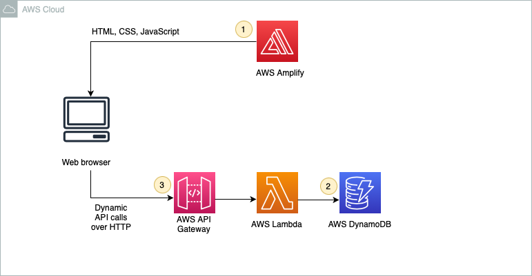

# Introduction
In this project, we will create a simple serverless web application that enables users to use a simple calculator. The application will present users with an HTML-based user interface for implementing a simple calculation such as addition/substract/multiplication/division between two numbers.

# Prerequisites
To complete this project, you will need an AWS account, a text editor, and a web browser. If you don't already have an AWS account, you can follow the [Setting Up Your AWS Environment](https://aws.amazon.com/getting-started/guides/setup-environment/) getting started guide for a quick overview.

# Application architecture
The application architecture uses AWS Lambda, Amazon API Gateway, Amazon DynamoDB, and AWS Amplify Console. Amplify Console provides continuous deployment and hosting of the static web resources including HTML, CSS, JavaScript. JavaScript executed in the browser sends and receives data from a public backend API built using Lambda and API Gateway. Finally, DynamoDB provides a persistence layer where data can be stored by the API's Lambda function.

1. **Static Web Hosting** AWS Amplify hosts static web resources including HTML, CSS, JavaScript. 
2. **Serverless Backend** Amazon DynamoDB provides a persistence layer where data can be stored by the API's Lambda function.
3. **RESTful API** JavaScript executed in the browser sends and receives data from a public backend API built using Lambda and API Gateway.

# Reference
1. [Architect and Build an End-to-End AWS Web Application from Scratch | AWS Project for Beginners](https://www.youtube.com/watch?v=7m_q1ldzw0U)
2. [https://aws.amazon.com/getting-started/hands-on/build-serverless-web-app-lambda-apigateway-s3-dynamodb-cognito/](https://aws.amazon.com/getting-started/hands-on/build-serverless-web-app-lambda-apigateway-s3-dynamodb-cognito/)

